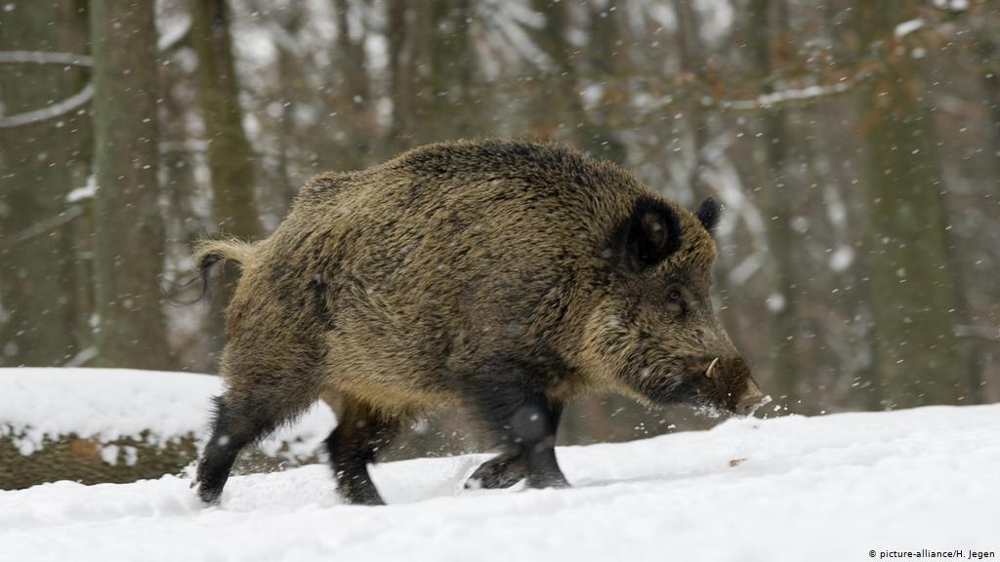
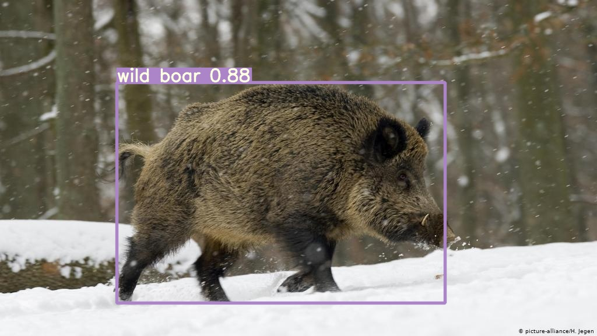

# Wild boar
The main goal of the algorithm is to predict a Wild Boar on the pic.


## Example
| sample input | sample output |
| --- | --- |
|  |  |


## Inference

detect.py runs inference on a variety of sources, downloading models automatically from the [latest YOLOv5 release](https://github.com/ultralytics/yolov5/releases) and saving results to `runs/detect`.
```bash
$ python detect.py --source 0  # webcam
                            file.jpg  # image 
                            file.mp4  # video
                            path/  # directory
                            path/*.jpg  # glob
                            rtsp://170.93.143.139/rtplive/470011e600ef003a004ee33696235daa  # rtsp stream
                            rtmp://192.168.1.105/live/test  # rtmp stream
                            http://112.50.243.8/PLTV/88888888/224/3221225900/1.m3u8  # http stream
```

To run inference on example images in `data/images`:
```bash
$ python detect.py --source data/images --weights yolov5s.pt --conf 0.25

Namespace(agnostic_nms=False, augment=False, classes=None, conf_thres=0.25, device='', img_size=640, iou_thres=0.45, save_conf=False, save_dir='runs/detect', save_txt=False, source='data/images/', update=False, view_img=False, weights=['yolov5s.pt'])
Using torch 1.7.0+cu101 CUDA:0 (Tesla V100-SXM2-16GB, 16130MB)

Downloading https://github.com/ultralytics/yolov5/releases/download/v3.1/yolov5s.pt to yolov5s.pt... 100%|██████████████| 14.5M/14.5M [00:00<00:00, 21.3MB/s]

Fusing layers... 
Model Summary: 232 layers, 7459581 parameters, 0 gradients
image 1/2 data/images/bus.jpg: 640x480 4 persons, 1 buss, 1 skateboards, Done. (0.012s)
image 2/2 data/images/zidane.jpg: 384x640 2 persons, 2 ties, Done. (0.012s)
Results saved to runs/detect/exp
Done. (0.113s)
```
